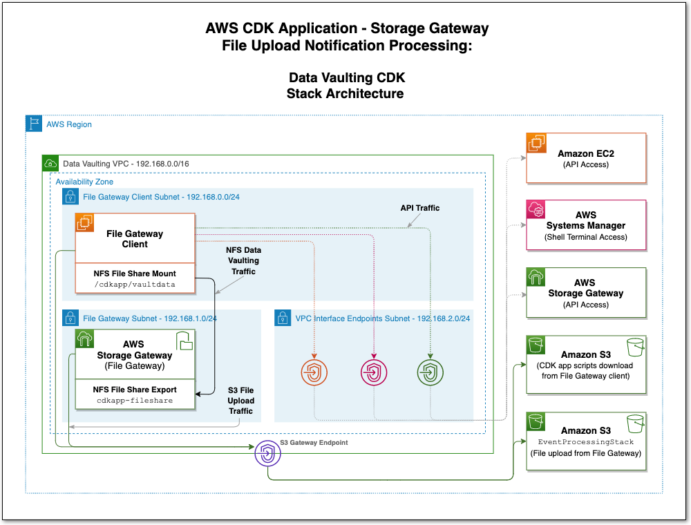

# AWS CDK application workshop to process AWS Storage Gateway (File Gateway) file upload notifications

© 2021 Amazon Web Services, Inc. and its affiliates. All rights reserved. This sample code is made available under the MIT-0 license. See the LICENSE file.

Feedback: Contact atieka@amazon.co.uk, djsearle@amazon.co.uk.

---

# Module 3 - Deploy the CDK application stacks
## 3.1 Event processing stack
First, we''ll deploy the `EventProcessingStack`. This will create all the resources and configuration for the event processing flow, as illustrated in the following architecture diagram:


The AWS Step Functions state machine implements the file upload event reconciliation logic. It executes a combination of Pass, Choice and Task states. Below is a summary of the steps executed:

* **Configure Count**: Configures the maximum total number of iterations the state machine will execute. The count value is obtained from the `reconcileCountIterations` CDK context key, as described in **Module 1**.
* **Reconcile Iterator**: Executes an AWS Lambda function that increases the value of the current iteration count by one. If the current value equals the maximum count value configured, the Lambda function will set the Boolean variable `continue` to False, preventing the state machine from entering another iteration loop.
* **Check Count Reached**: Checks to confirm if the Boolean variable `continue` is True or False. Proceeds to “Reconcile Check Upload” if True or “Reconcile Notify” if False.
* **Reconcile Check Upload**: Executes an AWS Lambda function that reads the “manifest” file from the Amazon S3 bucket and compares the contents with the file upload events written to the Amazon DynamoDB table. If these are identical, another Boolean variable `reconcileDone` is set to True, indicating the reconcile process has completed. This variable is set to False if these data sources do not match.
* **Reconcile Check Complete**: Checks to confirm if the Boolean variable `reconcileDone` is True or False. Proceeds to “Reconcile Notify” if True or “Wait” if False.
* **Wait**: A simple wait state that sleeps for a configured time. This sleep time is obtained from a CDK context key, as described in **Module 1**. This state is entered upon whenever Boolean variables, `continue` and `reconcileDone` are set to True and False respectively.
* **Reconcile Notify**: Executes an AWS Lambda function that sends an event to the EventBridge custom bus, notifying on the status of the reconciliation process. This is either “Successful” if completed within the maximum number of configured iterations or “Timed out” if not. Proceeds to the final “Done” state, completing the state machine execution.


Execute the following on the CDK client, this stack will take approximately 3-4 minutes to deploy:
```console
user@cdk-client>$ cdk deploy EventProcessingStack
```

Once complete, copy the name of the Amazon S3 bucket created by this stack - it is displayed as the `EventProcessingStack.fileUploadBucketName` key value at the end of the `cdk deploy` process.

## 3.2 Data vaulting stack
The Storage Gateway (File Gateway) and File Gateway client will be created as part of the `DataVaultingStack`, which we're now ready to deploy. All resources in this stack will be created in a private VPC with no Internet connectivity. **NOTE:** This stack only provisions resources in a single Availability Zone and has been designed to optimize cost. It is intended for temporary use in this workshop. Do not implement for production purposes.

The following diagram illustrates the data vaulting stack architecture:



Execute the following on the CDK client, this stack will take approximately 6-8 minutes to deploy:
```console
user@cdk-client>$ cdk deploy DataVaultingStack
```

The stack creates the following:
* A VPC with three private subnets and various VPC endpoints for the relevant AWS services.
* An Amazon S3 bucket used to deploy the CDK application scripts required in this workshop. These are automatically copied to the File Gateway client.
* 1 x c5.4xlarge Amazon EC2 instance using a Storage Gateway AMI and 150GB of additional IO1 EBS storage - to be used as a File Gateway. This instance resides within one of the Private subnets. It cannot communicate outside of the VPC and only allows inbound connections from the File Gateway client.
* 1 x c5.4xlarge Amazon EC2 instance using an Amazon Linux 2 AMI and 150GB of additional IO1 EBS storage - to be used as a File Gateway client. This instance resides in a private subnet. It cannot communicate outside of the VPC and allows no inbound connections.
* Security groups:

    |Security Group|Inbound Sources|Outbound Destinations|
    |---|---|---|
    |File Gateway|Ports 80 and 2049 from File Gateway client|All|
    |File Gateway client|None|All|
    |VPC Endpoint - AWS Storage Gateway|Ports 1026-1028, 1031, 2222 from File Gateway and Port 443 from VPC CIDR|All|
    |VPC Endpoints - Amazon EC2, AWS Systems Manager|Ports 443 from VPC CIDR|All|

We're now ready to activate and configure the Storage Gateway (File Gateway).

Move onto [Module 4 - Activate and configure the File Gateway](MODULE4.md) or return to the [main page](README.md).