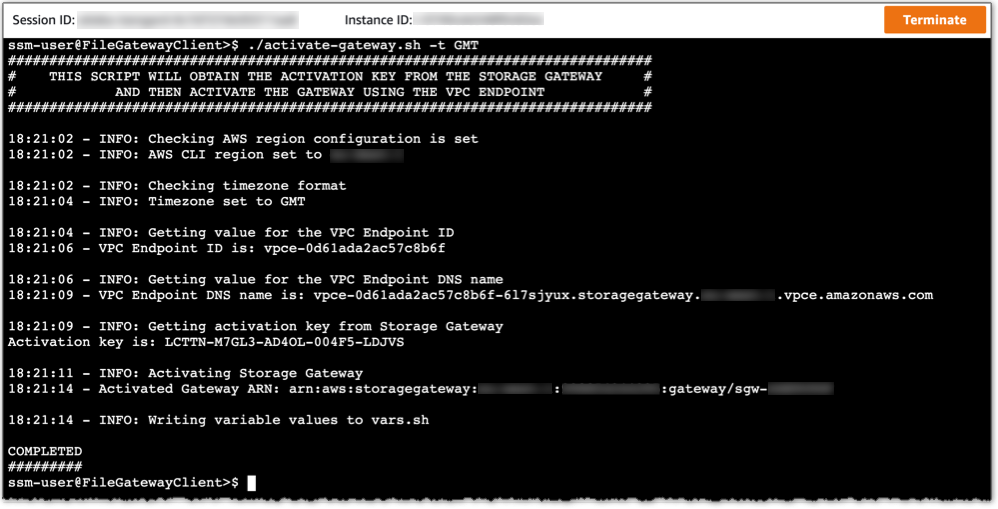
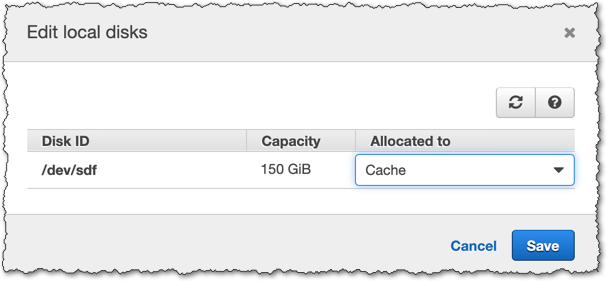
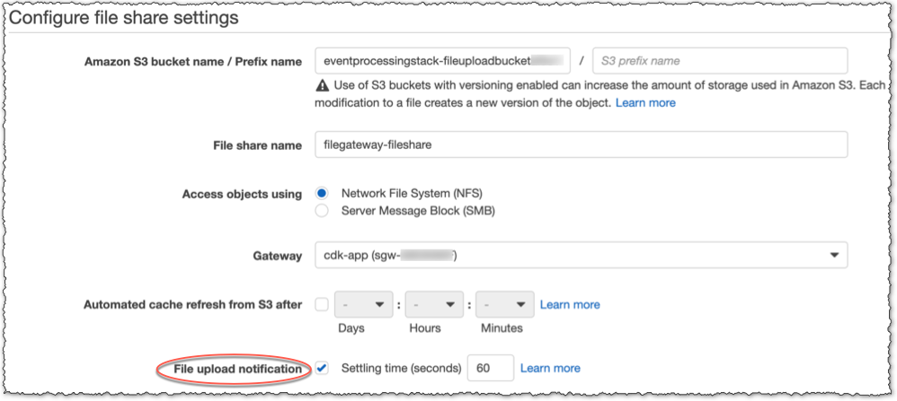

# AWS CDK application workshop to process AWS Storage Gateway (File Gateway) file upload notifications

© 2021 Amazon Web Services, Inc. and its affiliates. All rights reserved. This sample code is made available under the MIT-0 license. See the LICENSE file.

Feedback: Contact atieka@amazon.co.uk, djsearle@amazon.co.uk.

---

# Module 4 - Activate and configure the File Gateway
Since the Storage Gateway (File Gateway) instance can only be accessed from within the VPC just created, we will perform the activation commands on the File Gateway client. 

## 4.1 Log onto the File Gateway Client
1. Log onto the File Gateway client using AWS Systems Manager Session Manager (SSM). In the [Amazon EC2 console](https://console.aws.amazon.com/ec2) select the instance named **CDK App - File Gateway Client** and click **Connect** on the top toolbar:

    

2. On the next window select the **Session Manager** tab and click on **Connect**. A new browser window will open and you will be placed into an interactive terminal session on the File Gateway client:

    

3. Source user environment variables and navigate to the directory containing the scripts we'll be using in this workshop:
    ```console
    sh-4.2$ sudo su - ssm-user
    ssm-user@FileGatewayClient>$ cd /var/local/cdkapp-scripts && pwd
    /var/local/cdkapp-scripts
    ssm-user@FileGatewayClient>$
    ```

4. Set the AWS region for the AWS CLI. Substitute the `[REGION]` value below for the AWS region into which you have deployed this stack (see [**Module 2.3**](MODULE2.md#23-set-account-and-region-values). Leave all others values at their defaults (`None`):
    ```console
    ssm-user@FileGatewayClient>$ aws configure
    AWS Access Key ID [None]:
    AWS Secret Access Key [None]:
    Default region name [None]: [REGION]
    Default output format [None]:
    ssm-user@FileGatewayClient>$ 
    ```

## 4.2 Activate the File Gateway
We will use the `activate-gateway.sh` script to activate the Storage Gateway using the Storage Gateway VPC Endpoint. The script retrieves the VPC Endpoint ID value from AWS Systems Manager Parameter Store and uses this to obtain the VPC Endpoint DNS name. It then sends a `curl` request to the Storage Gateway on port 80, which the Storage Gateway responds to by returning an activation key. Finally, this key is used to submit an `activate-gateway` AWS CLI command to the the VPC Endpoint in order to activate the Storage Gateway as a File Gateway. Once this completes successfully, the File Gateway tears down the activation webserver process listening on port 80.

We need to provide one parameter to this script:

* `-t [TIMEZONE]`: The timezone to set on the Storage Gateway. The value is formatted as `GMT-hr:mm` or `GMT+hr:mm`. As an example, for London, the timezone value is `GMT`, for New York it would be `GMT-05:00`, or for Tokyo it would be `GMT+09:00`.

Execute the following command on the File Gateway client. The AWS region is ascertained from the configuration written when we executed `aws configure` in **section 4.1** above:
```console
ssm-user@FileGatewayClient>$ ./activate-gateway.sh -t [TIMEZONE]
```
Below is a screenshot illustrating an example execution of this script, using `GMT` as the `[TIMEZONE]`:



The `activate-gateway.sh` script writes the activated Storage Gateway ARN, in addition to the Amazon S3 bucket names used during this workshop, to the `vars.sh` file. We will need these in [**Module 7**](MODULE7.md) when we've completed this walkthough and are ready to delete all resources.

## 4.3 Configure the cache and create a file share
1. Open the [AWS Storage Gateway console](https://console.aws.amazon.com/storagegateway). The **cdk-app** File Gateway is listed. For a period of 2-3 minutes after activation the File Gateway may appear in an `Offline` state. Click the refresh arrows in the top right corner, periodically, until the status transitions to `Running`. An exclamation mark will display beside the `Running` status. This alert is communicating the lack of a configured cache volume. Select the File Gateway and in the **Details** tab click the **Edit local disks** button:

    

    In the pop up window, assign the single `/dev/sdf` disk ID as cache, then click **Save**. This is a 150GB IO1 EBS volume created as part of deploying the `DataVaultingStack` and attached to the File Gateway: 

    

2. An alert may appear in the **Details** tab notifying you of an available software update (if you can see no such alert, move on to the next step). If this is the case, go ahead and click the **Apply update now** button and after 30-60 seconds click the refresh arrows in the top right corner and your File Gateway software will have been updated.

3. Create a NFS file share by clicking the **Create file share** button at the top of the page. Enter the Amazon S3 bucket name created by the `EventProcessingStack` in [**Module 3.1**](MODULE3.md#31-event-processing-stack). You copied this bucket name earlier after that stack was deployed, but if you need to verify the value, view the stack creation output for `EventProcessingStack` in the [CloudFormation console](https://console.aws.amazon.com/cloudformation) - copy the value for the `fileUploadBucketName` key. Leave the prefix field empty. Name the file share `filegateway-fileshare` and select the **Network File System** radio button. Ensure the **File upload notification** option box is selected - **IMPORTANT**, if this option is not ticked, the event processing flow will fail to trigger since the File Gateway will not generate upload events. Set the **Settling time** to `60`:

    

4. Click **Next**. On the following page leave all selections at defaults and click **Next**. On the final **Review** page select **Edit** for the **Allowed clients** section and enter `192.168.0.10/32` and click **Close**. This limits file share access to the File Gateway client only. Leave all other options at defaults and click **Create file share**.

    

    The **File shares** page will list your new file share. This will transition from a `Creating` to `Available` state in approximately 30-60 seconds. Click the refresh arrows in the top right corner, periodically, and wait until the file share is `Available`.

5. Finally, mount the `filegateway-fileshare` just created on the File Gateway client:
    ```console
    ssm-user@FileGatewayClient>$ sudo mount -t nfs -o nolock,hard \
    192.168.1.10:/filegateway-fileshare /mnt/vaultdata && df -h | grep "/mnt/vaultdata"
    ```

    

We're now ready to execute an example data vaulting operation.

Move onto [Module 5 - Execute an example data vaulting operation](MODULE5.md) or return to the [main page](README.md).