# CDK application workshop to process AWS Storage Gateway (File Gateway) file upload notifications

© 2021 Amazon Web Services, Inc. and its affiliates. All rights reserved. This sample code is made available under the MIT-0 license. See the LICENSE file.

Feedback: Contact atieka@amazon.co.uk, djsearle@amazon.co.uk.

---

## Workshop scenario
This is a workshop that deploys a CDK application based on the file notification event processing solution described in [this blog](https://aws.amazon.com/blogs/storage/processing-file-upload-notifications-from-aws-storage-gateway-on-amazon-s3/).

Many customers use AWS Storage Gateway (File Gateway) to upload individual files to Amazon Simple Storage Service. Together, these files often constitute a larger logical set of data that should be grouped for downstream processing. A common example is when data is vaulted from source systems. This CDK application is designed for such a use-case and leverages the [File Upload Notification](https://docs.aws.amazon.com/storagegateway/latest/userguide/monitoring-file-gateway.html#get-file-upload-notification) feature of File Gateway to implement an event processing flow. NOTE: This application is not a fully fledged data vaulting solution, but can be used as a component within a larger implementation - e.g. to process file upload events for object archives making their way to a final vault location on AWS.

## Topics covered
* Overview of the example data vaulting use-case
* Setting up and deploying resources using the AWS Cloud Development Kit
* Activating and configuring a Storage Gateway (File Gateway)
* Generating and copying sample data from a File Gateway client
* Using Storage Gateway (File Gateway) to vault data to Amazon S3
* Observing the event processing flow in action

## Pre-requisites
* An AWS account
* Ability to run the AWS CLI on your machine
* Internet browser (Chrome or Firefox recommended)

## Costs
This workshop will cost approximately $3-4 in AWS service charges and require 1 hour to complete. Once you have finished, destroy the deployed CDK application stacks in order to prevent further charges (see **Module 7**).

## Workshop modules
* Module 1 - Overview of the architecture and solution components
* Module 2 - CDK pre-requisites and preparation
* Module 3 - Deploy the CDK application stacks
* Module 4 - Activate and configure the File Gateway
* Module 5 - Execute an example data vaulting operation
* Module 6 - Observe the event processing flow
* Module 7 - Cleanup

## Module 1 - Solution components and architecture
For data vaulted via a File Gateway, the CDK application components work with the following principles:
* **Logical Datasets:** A group of files and directories stored in a uniquely named folder on a File Gateway file share. These files represent a single logical dataset to be vaulted to Amazon S3 and treated as a single entity for the purposes of downstream processing. The files are copied from a source location that mounts the File Gateway file share using NFS or SMB.
* **Logical Dataset IDs:** A unique string that identifies a specific logical dataset. This is used as part of the name for the root directory containing a single logical dataset created on a File Gateway file share. The Dataset ID allows the event processing flow to distinguish between different vaulted datasets and reconcile within them accordingly.
* **Data Files:** All files that constitute part of a logical dataset. These are written within a root logical dataset folder on a File Gateway file share. File upload notification events generated for data files are written, by the processing flow, to an Amazon DynamoDB table. Directories are treated as file objects for the purposes of uploads to Amazon S3 via File Gateway.
* **Manifest Files:** A file, one per logical dataset, that contains a manifest listing all data files that constitute that specific logical dataset. This is generated as part of the data vaulting operation for a logical dataset and is used by the processing flow to compare against data file upload events written to a DynamoDB table. Once both of these data sources are identical, it signifies the File Gateway has completed uploading all files to Amazon S3 that constitute that logical dataset and the data vaulting operation has completed.

The processing flow implemented by this CDK application contains the following mandatory, but configurable, parameters. These can be modified by editing the corresponding CDK context values in `cdk.context.json`:
* **Vault folder directory suffix name:** Context key name: `jobDirSuffixName`. The directory suffix name of the root folder containing a logical dataset copied to File Gateway. This is used by the processing flow to identify what directories being created on a File Gateway should be processed. Directories created that do not end in this suffix will be ignored. Default: `-vaultjob`. Do not modify this value for the workshop - can be modified if using your own data vaulting scripts.
* **Manifest file suffix name:** Context key name: `manifestSuffixName`. The suffix name for the logical dataset manifest file. This is used by the processing flow to identify what file should be read to ascertain the list of files constituting the logical dataset and used to reconcile against file upload notification events received. Default: `.manifest`. Do not modify this value for the workshop - can be modified if using your own data vaulting scripts.
* **Number of iterations in State Machine:** Context key name: `reconcileCountIterations`. The number of attempts the file upload reconciliation state machine will make to reconcile the contents of the logical dataset manifest file with the file upload notification events received. Due to the asynchronous nature in which File Gateway uploads files to Amazon S3, a manifest file may be uploaded prior to all data files in that logical dataset. This is especially the case for large datasets. Hence, iterating over the file upload reconciliation process is required. Default: `960`.
* **Wait time in State Machine:** Context key name: `reconcileWaitIterations`. The time, in seconds, to wait between each iteration of the file upload reconciliation state machine. Default: `30`. The total time the state machine will continue to attempt file upload reconciliation is a product of this parameter and the number of iterations in the state machine. At default values this works out to 8 hours.
* **AWS account ID:** Context key name: `stacksAccountId`. The AWS account ID/number to deploy the CDK application stacks into.
* **AWS region:** Context key name: `stacksRegion`. The AWS region to deploy the CDK application stacks into.

An example logical dataset directory structure:
```
[LOGICAL DATASET ID]-vaultjob (root logical dataset directory)
[LOGICAL DATASET ID]-vaultjob/[DATA FILE][..] (data files at top level)
[LOGICAL DATASET ID]-vaultjob/[DIRECTORY][..]/[DATA FILE][..] (data files at n levels)
[LOGICAL DATASET ID]-vaultjob/[LOGICAL DATASET ID].manifest (recursive list of all files and dirs)
```

### 1.1 CDK application architecture
The following diagram illustrates the architecture for the processing flow implemented by this CDK application. It details the individual execution stages for each of the two file types uploaded ("data" and "manifest" files). For a higher resolution image, view `notification-processing-cdk-app-arch-high-res.png` within the `images/arch` folder of this repository:

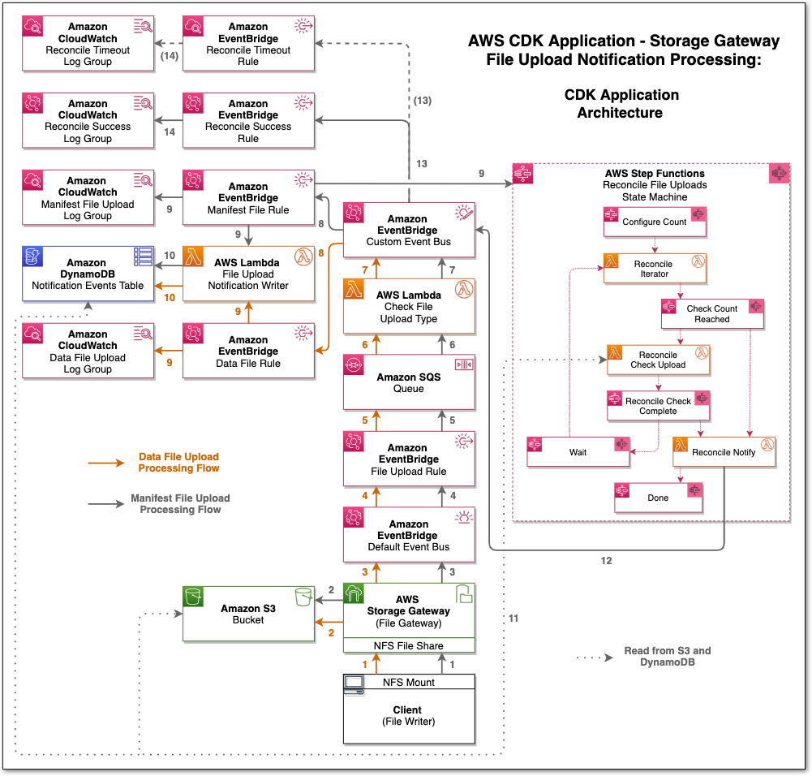

### 1.2 Example event processing flow execution timeline
The diagram `notification-processing-example-data-vaulting-timeline.png` within the `images/arch` folder of this repository illustrates the timeline and execution steps implemented by this CDK application for the processing of File Gateway upload notifications. It details an example scenario for a data vaulting operation and how each CDK resource created is executed, and in what order, during the event processing flow. NOTE: The "time" dimension in this diagram is not scaled or linear - it is meant as an indicative representation of the order in which resources are used in the example scenario illustrated.

### 1.3 CDK application stacks
This CDK application contains two stacks (listed in the order deployed in this workshop):
* **EventProcessingStack:**
Deploys the event processing architecture illustrated in **section 1.1** above, intended to be used with a Storage Gateway (File Gateway) configured to generate file upload notifications. More information on deploying this stack is provided in **Module 3.1**. NOTE: This stack does not create the File Gateway or File Gateway client. These are created as part of the `DataVaultingStack`.

* **DataVaultingStack:**
Deploys a "minimal" VPC with two EC2 instances - a Storage Gateway (File Gateway) appliance and a File Gateway client. This stack is used to demonstrate an example data vaulting operation using a File Gateway appliance, triggering the event processing flow created by the `EventProcessingStack` above. The resources created by this stack are intended for temporary demonstration purposes and are used to illustrate a potential real-world use-case for the event processing flow. More information on deploying this stack is provided in **Module 3.2**. 

## Module 2 - CDK pre-requisites and preparation
Follow the steps below to ensure pre-requisites are in place, before deploying the CDK application stacks to the configured AWS account and region environment. The following should be performed on the machine where you are executing the CDK CLI commands. This machine will be referred to as the "CDK client" and all commands in this Module are executed on it.

### 2.1 Pre-requisites
* Python 3.6 or later, with pip and virtualenv
* AWS CDK (`sudo npm install -g aws-cdk`)
* AWS CLI configured using `aws configure`
* An AWS CLI role/user with required permissions for the resources created

### 2.2 Download the CDK application code
Clone or download this repository on your CDK client and navigate to the directory created.

### 2.3 Set account and region values
Edit the `cdk.context.json` file and add appropriate values for the `"stacksAccountId"` and `"stacksRegion"` context keys. Both stacks in this application will be deployed into the same AWS account and region specified by these values.

### 2.4 Create the Python environment and install dependencies
```console
user@cdk-client>$ python3 -m venv .venv
user@cdk-client>$ source .venv/bin/activate (Linux or Mac)
user@cdk-client>% .venv\Scripts\activate.bat (Windows)
user@cdk-client>$ pip install -r requirements.txt
```

You can list the CDK context key values by executing the following command. The keys specific to this application are explained in **Module 1**:
```console
user@cdk-client>$ cdk context
┌────┬─────────────────────────────────────────────┬────────────────┐
│ #  │ Key                                         │ Value          │
├────┼─────────────────────────────────────────────┼────────────────┤
│ 1  │ @aws-cdk/aws-ecr-assets:dockerIgnoreSupport │ true           │
├────┼─────────────────────────────────────────────┼────────────────┤
│ 2  │ @aws-cdk/core:enableStackNameDuplicates     │ "true"         │
├────┼─────────────────────────────────────────────┼────────────────┤
│ 3  │ @aws-cdk/core:stackRelativeExports          │ "true"         │
├────┼─────────────────────────────────────────────┼────────────────┤
│ 4  │ aws-cdk:enableDiffNoFail                    │ "true"         │
├────┼─────────────────────────────────────────────┼────────────────┤
│ 5  │ jobDirSuffixName                            │ "-vaultjob"    │
├────┼─────────────────────────────────────────────┼────────────────┤
│ 6  │ manifestSuffixName                          │ ".manifest"    │
├────┼─────────────────────────────────────────────┼────────────────┤
│ 7  │ reconcileCountIterations                    │ "960"          │
├────┼─────────────────────────────────────────────┼────────────────┤
│ 8  │ reconcileWaitIterations                     │ "30"           │
├────┼─────────────────────────────────────────────┼────────────────┤
│ 9  │ stacksAccountId                             │ "ACCOUNT ID"   │
├────┼─────────────────────────────────────────────┼────────────────┤
│ 10 │ stacksRegion                                │ "AWS REGION"   │
└────┴─────────────────────────────────────────────┴────────────────┘
Run cdk context --reset KEY_OR_NUMBER to remove a context key. It will be refreshed on the next CDK synthesis run.
user@cdk-client>$ 
```

### 2.5 Bootstrap the CDK environment
Since we will be using [CDK Assets](https://docs.aws.amazon.com/de_de/cdk/latest/guide/assets.html) to deploy the `DataVaultingStack`, we need to bootstrap the CDK environment. Execute the following to do this:
```console
user@cdk-client>$ cdk bootstrap
```

### 2.6 List the stacks in this CDK application
Execute the following to list the CDK application stacks. NOTE: The `DataVaultingStack` performs an EC2 AMI lookup in order to select the latest Storage Gateway AMI - this value will be cached in `cdk.context.json` when the first stack is synthesized (next step) and AMI lookups will no longer be performed until/unless the [cached values are reset/removed](https://docs.aws.amazon.com/cdk/latest/guide/context.html). The cached AMI value can be used for the remainder of this workshop:
```console
user@cdk-client>$ cdk ls
Searching for AMI in [stacksAccountId]:[stacksRegion]
DataVaultingStack
EventProcessingStack
user@cdk-client>$ 
```

### 2.7 Synthesize the AWS CloudFormation templates for the CDK stacks
```console
user@cdk-client>$ cdk synth
Searching for AMI in [stacksAccountId]:[stacksRegion]
Successfully synthesized to [DIRECTORY PATH]/cdk.out
Supply a stack id (DataVaultingStack, EventProcessingStack) to display its template.
user@cdk-client>$ 
```

We're now ready to deploy the stacks.

## Module 3 - Deploy the CDK application stacks
### 3.1 Event processing stack
First, we''ll deploy the `EventProcessingStack`. This will create all the resources and configuration for the event processing flow, as illustrated in the following architecture diagram:

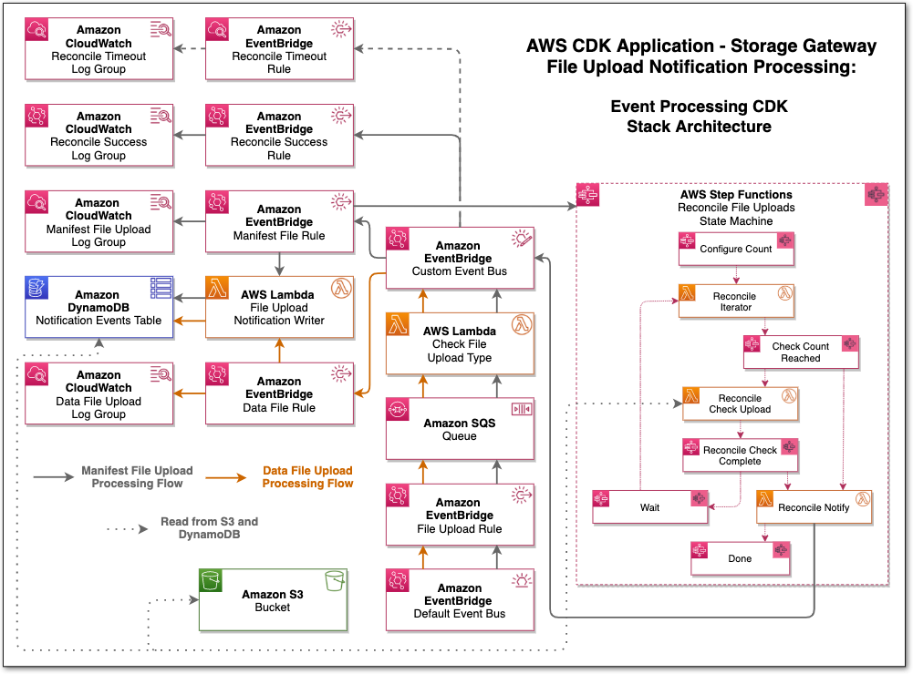

The AWS Step Functions state machine implements the file upload event reconciliation logic. It executes a combination of Pass, Choice and Task states. Below is a summary of the steps executed:

* **Configure Count**: Configures the maximum total number of iterations the state machine will execute. The count value is obtained from the `reconcileCountIterations` CDK context key, as described in **Module 1**.
* **Reconcile Iterator**: Executes an AWS Lambda function that increases the value of the current iteration count by one. If the current value equals the maximum count value configured, the Lambda function will set the Boolean variable `continue` to False, preventing the state machine from entering another iteration loop.
* **Check Count Reached**: Checks to confirm if the Boolean variable `continue` is True or False. Proceeds to “Reconcile Check Upload” if True or “Reconcile Notify” if False.
* **Reconcile Check Upload**: Executes an AWS Lambda function that reads the “manifest” file from the Amazon S3 bucket and compares the contents with the file upload events written to the Amazon DynamoDB table. If these are identical, another Boolean variable `reconcileDone` is set to True, indicating the reconcile process has completed. This variable is set to False if these data sources do not match.
* **Reconcile Check Complete**: Checks to confirm if the Boolean variable `reconcileDone` is True or False. Proceeds to “Reconcile Notify” if True or “Wait” if False.
* **Wait**: A simple wait state that sleeps for a configured time. This sleep time is obtained from a CDK context key, as described in **Module 1**. This state is entered upon whenever Boolean variables, `continue` and `reconcileDone` are set to True and False respectively.
* **Reconcile Notify**: Executes an AWS Lambda function that sends an event to the EventBridge custom bus, notifying on the status of the reconciliation process. This is either “Successful” if completed within the maximum number of configured iterations or “Timed out” if not. Proceeds to the final “Done” state, completing the state machine execution.


Execute the following on the CDK client, this stack will take approximately 3-4 minutes to deploy:
```console
user@cdk-client>$ cdk deploy EventProcessingStack
```

Once complete, copy the name of the Amazon S3 bucket created by this stack - it is displayed as the `EventProcessingStack.fileUploadBucketName` key value at the end of the `cdk deploy` process.

### 3.2 Data vaulting stack
The Storage Gateway (File Gateway) and File Gateway client will be created as part of the `DataVaultingStack`, which we're now ready to deploy. All resources in this stack will be created in a private VPC with no Internet connectivity. **NOTE:** This stack only provisions resources in a single Availability Zone and has been designed to optimize cost. It is intended for temporary use in this workshop. Do not implement for production purposes.

The following diagram illustrates the data vaulting stack architecture:

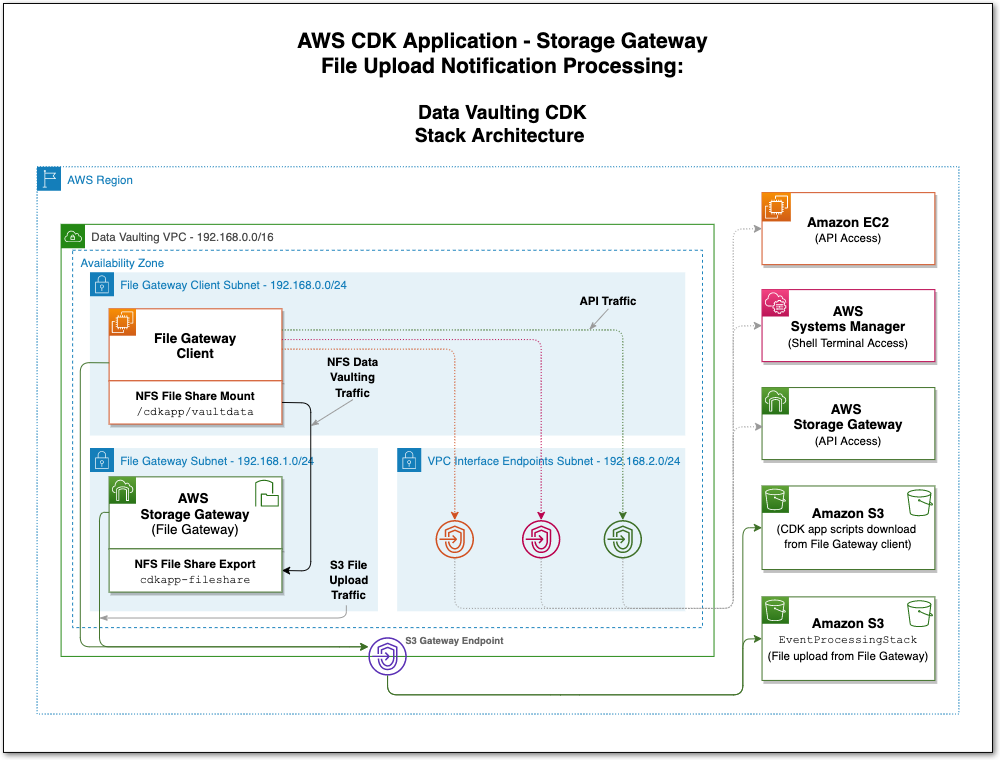

Execute the following on the CDK client, this stack will take approximately 6-8 minutes to deploy:
```console
user@cdk-client>$ cdk deploy DataVaultingStack
```

The stack creates the following:
* A VPC with three private subnets and various VPC endpoints for the relevant AWS services.
* An Amazon S3 bucket used to deploy the CDK application scripts required in this workshop. These are automatically copied to the File Gateway client.
* 1 x c5.4xlarge Amazon EC2 instance using a Storage Gateway AMI and 150GB of additional IO1 EBS storage - to be used as a File Gateway. This instance resides within one of the Private subnets. It cannot communicate outside of the VPC and only allows inbound connections from the File Gateway client.
* 1 x c5.4xlarge Amazon EC2 instance using an Amazon Linux 2 AMI and 150GB of additional IO1 EBS storage - to be used as a File Gateway client. This instance resides in a private subnet. It cannot communicate outside of the VPC and allows no inbound connections.
* Security groups:

    |Security Group|Inbound Sources|Outbound Destinations|
    |---|---|---|
    |File Gateway|Ports 80 and 2049 from File Gateway client|All|
    |File Gateway client|None|All|
    |VPC Endpoint - AWS Storage Gateway|Ports 1026-1028, 1031, 2222 from File Gateway and Port 443 from VPC CIDR|All|
    |VPC Endpoints - Amazon EC2, AWS Systems Manager|Ports 443 from VPC CIDR|All|

We're now ready to activate and configure the Storage Gateway (File Gateway)

## Module 4 - Activate and configure the File Gateway
Since the Storage Gateway (File Gateway) instance can only be accessed from within the VPC just created, we will perform the activation commands on the File Gateway client. 

#### 4.1 Log onto the File Gateway Client
1. Log onto the File Gateway client using AWS Systems Manager Session Manager (SSM). In the [Amazon EC2 console](https://console.aws.amazon.com/ec2) select the instance named **CDK App - File Gateway Client** and click **Connect** on the top toolbar:

    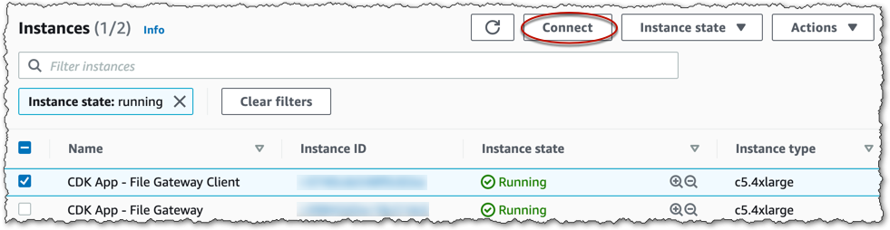

2. On the next window select the **Session Manager** tab and click on **Connect**. A new browser window will open and you will be placed into an interactive terminal session on the File Gateway client:

    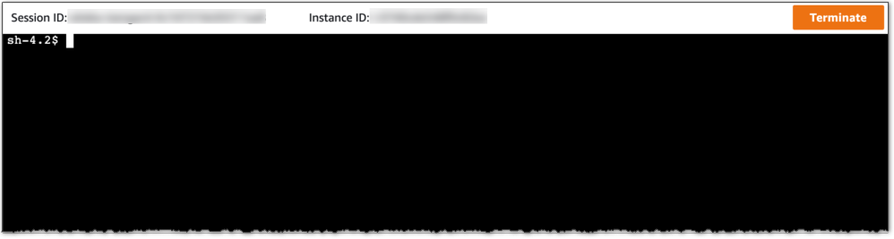

3. Source user environment variables and navigate to the directory containing the scripts we'll be using in this workshop:
    ```console
    sh-4.2$ sudo su - ssm-user
    ssm-user@FileGatewayClient>$ cd /var/local/cdkapp-scripts && pwd
    /var/local/cdkapp-scripts
    ssm-user@FileGatewayClient>$
    ```

4. Set the AWS region for the AWS CLI. Substitute the `[REGION]` value below for the AWS region into which you have deployed this stack (see **Module 2.3**). Leave all others values at their defaults (`None`):
    ```console
    ssm-user@FileGatewayClient>$ aws configure
    AWS Access Key ID [None]:
    AWS Secret Access Key [None]:
    Default region name [None]: [REGION]
    Default output format [None]:
    ssm-user@FileGatewayClient>$ 
    ```

#### 4.2 Activate the File Gateway
We will use the `activate-gateway.sh` script to activate the Storage Gateway using the Storage Gateway VPC Endpoint. The script retrieves the VPC Endpoint ID value from AWS Systems Manager Parameter Store and uses this to obtain the VPC Endpoint DNS name. It then sends a `curl` request to the Storage Gateway on port 80, which the Storage Gateway responds to by returning an activation key. Finally, this key is used to submit an `activate-gateway` AWS CLI command to the the VPC Endpoint in order to activate the Storage Gateway as a File Gateway. Once this completes successfully, the File Gateway tears down the activation webserver process listening on port 80.

We need to provide one parameter to this script:

* `-t [TIMEZONE]`: The timezone to set on the Storage Gateway. The value is formatted as `GMT-hr:mm` or `GMT+hr:mm`. As an example, for London, the timezone value is `GMT`, for New York it would be `GMT-05:00`, or for Tokyo it would be `GMT+09:00`.

Execute the following command on the File Gateway client. The AWS region is ascertained from the configuration written when we executed `aws configure` in **section 4.1** above:
```console
ssm-user@FileGatewayClient>$ ./activate-gateway.sh -t [TIMEZONE]
```
Below is a screenshot illustrating an example execution of this script, using `GMT` as the `[TIMEZONE]`:

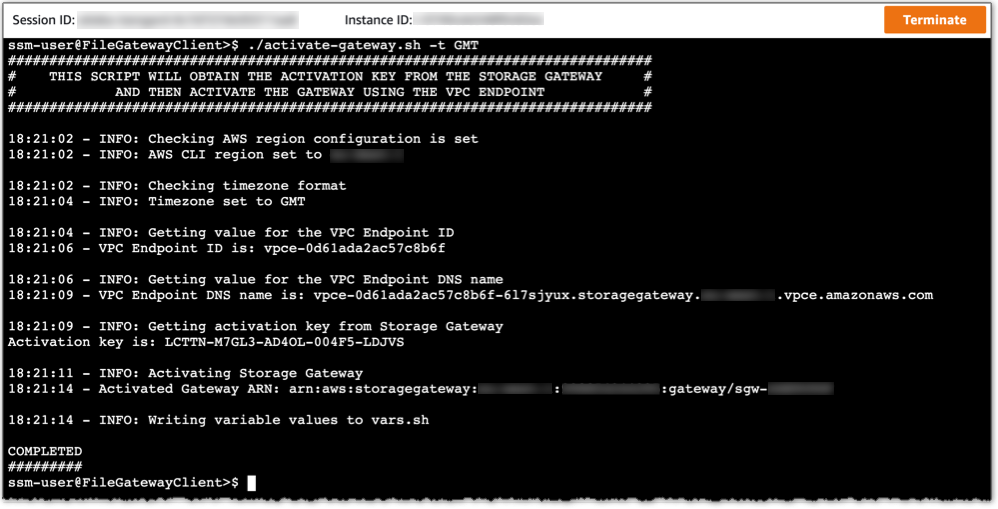

The `activate-gateway.sh` script writes the activated Storage Gateway ARN, in addition to the Amazon S3 bucket names used during this workshop, to the `vars.sh` file. We will need these in **Module 7** when we've completed this walkthough and are ready to delete all resources.

#### 4.3 Configure the cache and create a file share
1. Open the [AWS Storage Gateway console](https://console.aws.amazon.com/storagegateway). The **cdk-app** File Gateway is listed. For a period of 2-3 minutes after activation the File Gateway may appear in an `Offline` state. Click the refresh arrows in the top right corner, periodically, until the status transitions to `Running`. An exclamation mark will display beside the `Running` status. This alert is communicating the lack of a configured cache volume. Select the File Gateway and in the **Details** tab click the **Edit local disks** button:

    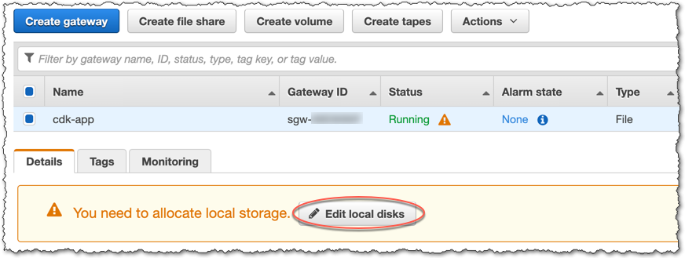

    In the pop up window, assign the single `/dev/sdf` disk ID as cache, then click **Save**. This is a 150GB IO1 EBS volume created as part of deploying the `DataVaultingStack` and attached to the File Gateway: 

    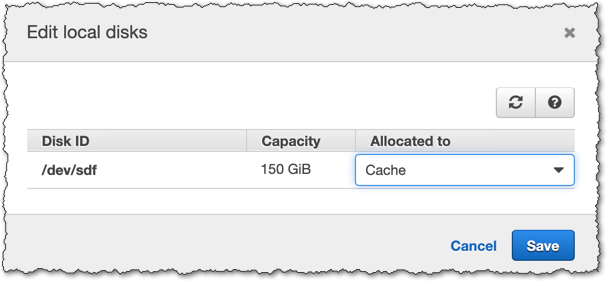

2. An alert may appear in the **Details** tab notifying you of an available software update (if you can see no such alert, move on to the next step). If this is the case, go ahead and click the **Apply update now** button and after 30-60 seconds click the refresh arrows in the top right corner and your File Gateway software will have been updated.

3. Create a NFS file share by clicking the **Create file share** button at the top of the page. Enter the Amazon S3 bucket name created by the `EventProcessingStack` in **Module 3.1**. You copied this bucket name earlier after that stack was deployed, but if you need to verify the value, view the stack creation output for `EventProcessingStack` in the [CloudFormation console](https://console.aws.amazon.com/cloudformation) - copy the value for the `fileUploadBucketName` key. Leave the prefix field empty. Name the file share `filegateway-fileshare` and select the **Network File System** radio button. Ensure the **File upload notification** option box is selected - **IMPORTANT**, if this option is not ticked, the event processing flow will fail to trigger since the File Gateway will not generate upload events. Set the **Settling time** to `60`:

    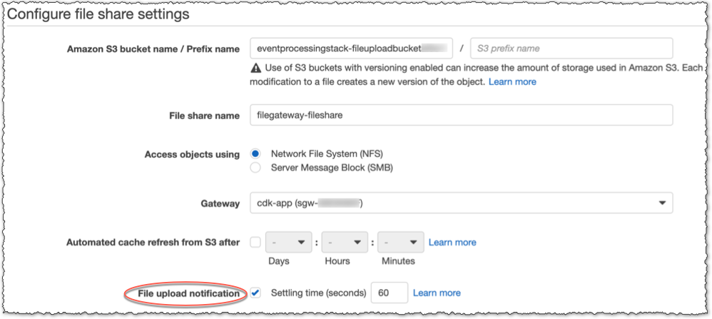

4. Click **Next**. On the following page leave all selections at defaults and click **Next**. On the final **Review** page select **Edit** for the **Allowed clients** section and enter `192.168.0.10/32` and click **Close**. This limits file share access to the File Gateway client only. Leave all other options at defaults and click **Create file share**.

    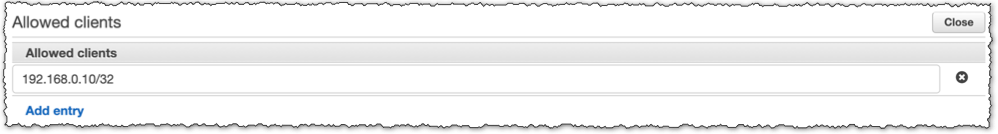

    The **File shares** page will list your new file share. This will transition from a `Creating` to `Available` state in approximately 30-60 seconds. Click the refresh arrows in the top right corner, periodically, and wait until the file share is `Available`.

5. Finally, mount the `filegateway-fileshare` just created on the File Gateway client:
    ```console
    ssm-user@FileGatewayClient>$ sudo mount -t nfs -o nolock,hard \
    192.168.1.10:/filegateway-fileshare /mnt/vaultdata && df -h | grep "/mnt/vaultdata"
    ```

    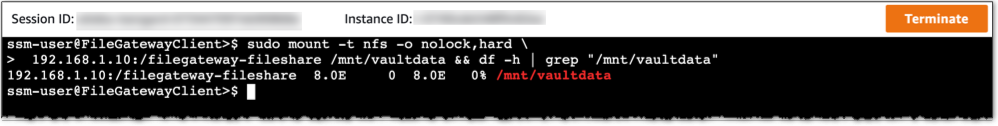

We're now ready to execute an example data vaulting operation.

## Module 5 - Execute an example data vaulting operation
Two steps are involved in the data vaulting process: 

1. Creating sample data on the File Gateway client.
2. Copying (vaulting) the sample data to the File Gateway file share.

In order to make this process quick and easy, we'll use some scripts provided in the `/var/local/cdkapp-scripts` directory.

### 5.1 Scripts and directories used for data vaulting
The scripts used for simulating a data vaulting operation are located in the `example-scripts` directory in this repository and are suitable for running on a Linux platform using a Bash shell. They have already been copied onto the File Gateway client as part of deploying the `DataVaultingStack`.

The directories below, on the File Gateway client, will be used in the following steps:
* Source data directory: `/mnt/sourcedata`. Directory into which we will generate source data to be used as an example logical dataset to be vaulted. The File Gateway client is pre-configured with a 150GB IO1 EBS volume mounted under this directory. 
* Vault data directory: `/mnt/vaultdata`. Directory mountpoint for the NFS file share exported by the File Gateway, into which we will vault data. We created and mounted this file share in **Module 4.3**.

See the `DataVaultingStack` architecture diagram in **Module 3.2** for an illustration of the data vaulting traffic flows.

### 5.2 Generate the sample data
We will use the `generate-test-data.sh` script to create the sample logical dataset. Further options are available to this script, which can be viewed by executing it with the `-h` flag. The data created by this script will become the source of the data vaulting operation itself (**section 5.3** below).

To generate a 100GB sample logical dataset, execute the following command on the File Gateway client (including the `sudo`). This will take between 4-5 minutes to complete:
```console
ssm-user@FileGatewayClient>$ sudo ./generate-test-data.sh -s 100 -b 50 -t /mnt/sourcedata
```

The script uses the `openssl` command to populate files with actual data (pseudo-random bytes), as opposed to simply creating "sparse" files full of zeroes. This provides for a more realistic data copy and upload scenario. Below is a screenshot illustrating an example execution of this script:

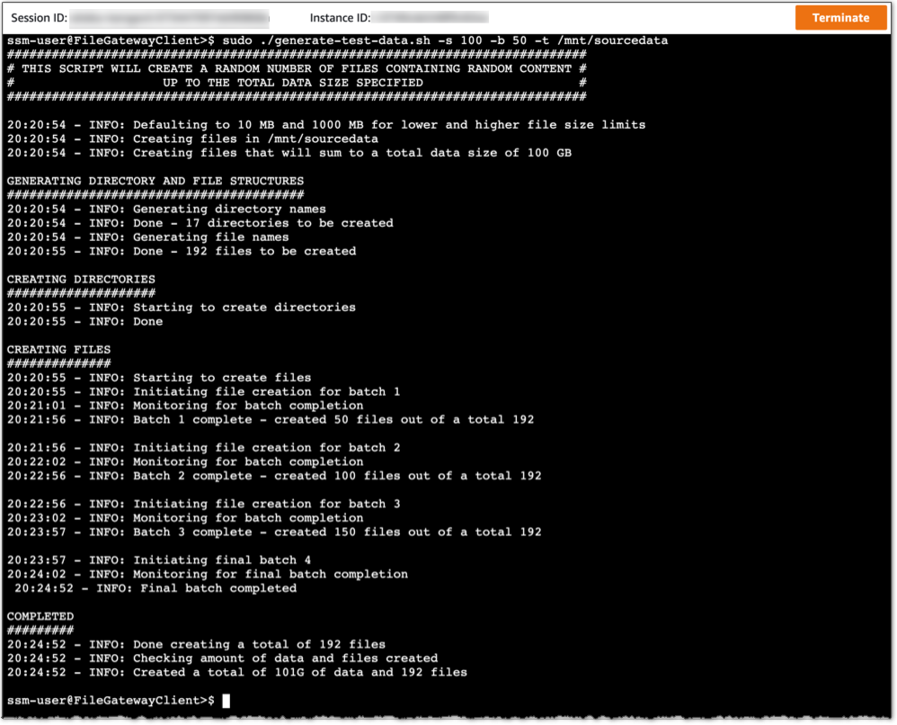

### 5.3 Vault the sample data
The `vault-data-example.sh` script is used to copy (vault) the sample logical dataset we've just created. We will use the script to copy the files and directories just created in `/mnt/sourcedata` to `/mnt/vaultdata`. The script will create a random logical dataset ID and also generate a "manifest" file as per the scheme described in **Module 1**. The File Gateway will upload data copied to `/mnt/vaultdata` to the Amazon S3 bucket created by the `EventProcessingStack`. Files and directories copied will generate File Gateway upload notifications to be consumed and reconciled by the event processing flow.

Execute the following command on the File Gateway client to perform the copy operation (including the `sudo`). This will take between 7-8 minutes to run:
```console
ssm-user@FileGatewayClient>$ sudo ./vault-data-example.sh -s /mnt/sourcedata -t /mnt/vaultdata
```

The script uses the `xargs` command to copy multiple files and directories in parallel. Below is a screenshot illustrating an example execution of this script:

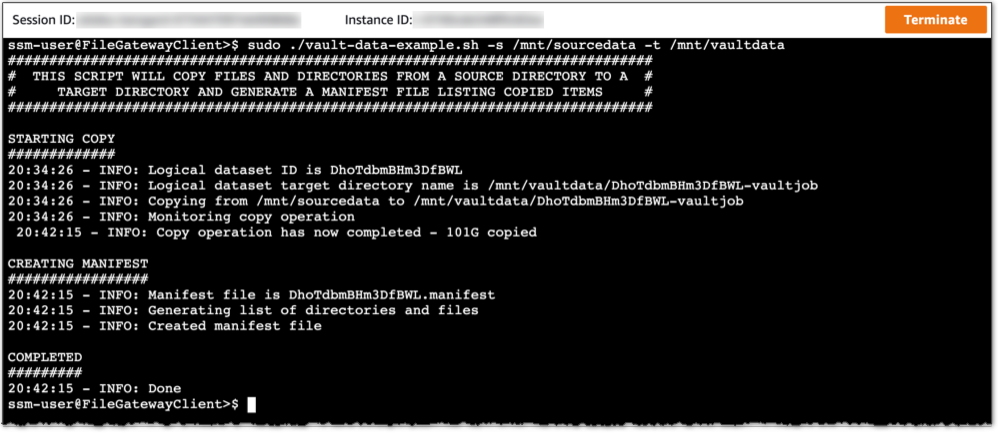

We're now ready to observe the actions taken by the event processing flow in response to the file upload notifications generated by the File Gateway.

### Module 6 - Observe the event processing flow
To observe the event processing flow in action, for this example data vaulting operation, you can inspect the logs/objects/items/invocations created within the multiple resources deployed by the `EventProcessingStack`:

Viewing the following resources in the order listed demonstrates how the processing flow executed: 

* **Amazon S3 Bucket:** Objects created in the Amazon S3 bucket, uploaded by the File Gateway.
* **Amazon CloudWatch Logs:** Logs created to record "data" and "manifest" file upload event types.
* **Amazon DynamoDB Table:** Items created to record the receipt of upload events.
* **AWS Step Functions state machine:** State machine execution that reconciles "manifest" file contents against the file upload events recieved.
* **Amazon CloudWatch Logs:** File upload reconciliation events emitted by the Step Functions state machine.

Below are some AWS console screenshots illustrating the information logged/written to these resource types. Vist these same console pages in your account to view the corresponding information for your example data vaulting operation:

* **Amazon S3 Bucket:** [Amazon S3 console link](https://console.aws.amazon.com/s3). Files and directories written to `/mnt/vaultdata` uploaded to Amazon S3 by the File Gateway for this example data vaulting operation. The relevant Amazon S3 bucket name will begin with `eventprocessingstack-fileuploadbucket`:

    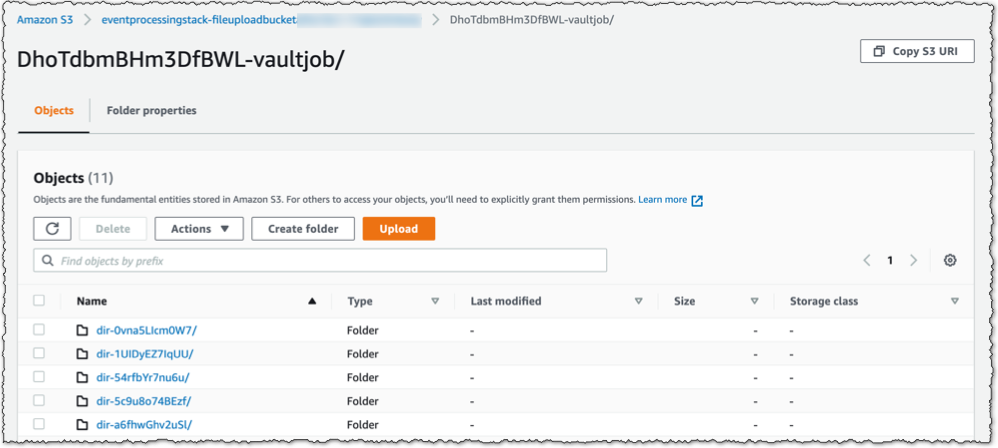

* **CloudWatch Logs "data" file Log group:** [CloudWatch Logs console link](https://console.aws.amazon.com/cloudwatch). File upload notification events for "data" files. You'll notice the logical dataset ID `set-id` is ascertained from the name of the logical dataset directory created by the data vaulting script in **Module 5.3**. It follows the scheme described in **Module 1**. The relevant CloudWatch Logs log group name will begin with `EventProcessingStack-dataFileUpload`:

    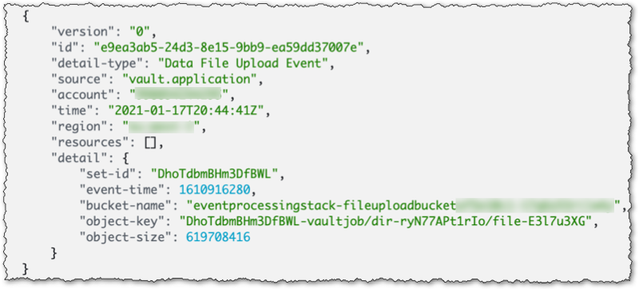

* **DynamoDB Table:** [DynamoDB console link](https://console.aws.amazon.com/dynamodb). Relevant metadata from the file upload notifications are written to this table, an item will exist for every upload notification. The relevant DynamoDB table name will begin with `EventProcessingStack-fileUploadEventTable`:

    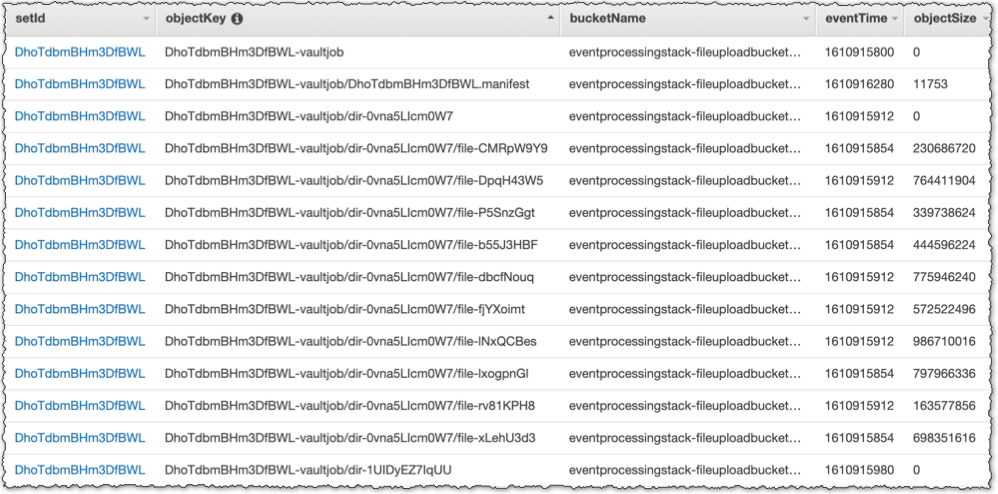

* **Step Functions state machine:** [Step Functions console link](https://console.aws.amazon.com/states). A successfully executed file upload reconciliation state machine - NOTE: The state `waitBetweenIterationsState` may be coloured white (instead of green). This simply means the state machine did not need to iterate (and wait) in order to reconcile upload events with the contents of the "manifest" file - i.e. after uploading the "manifest" file, the File Gateway completed all remaining "data" file uploads within the waiting time period set by the `reconcileWaitIterations` CDK context key contained in the `cdk.context.json` file (for a reminder on this CDK context key see **Module 1**). The relevant state machine name will begin with `reconcileStateMachine`:

    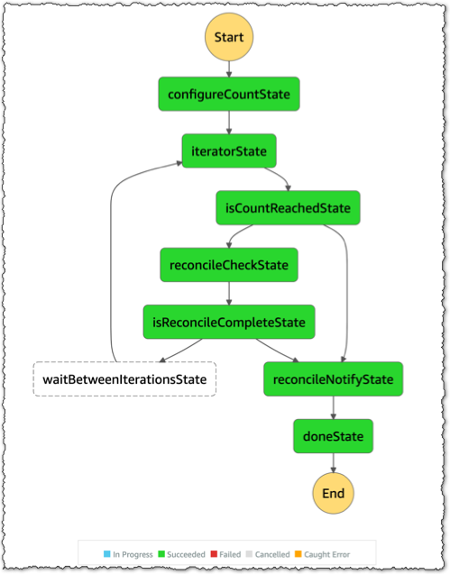

* **CloudWatch Logs "reconcile notification" Log group:** [CloudWatch Logs console link](https://console.aws.amazon.com/cloudwatch). A successful file upload reconciliation event is emitted by the Step Functions state machine - this is the final stage in the event processing flow for a particular logical dataset. The relevant CloudWatch Logs log group name will begin with `EventProcessingStack-reconcileNotifySuccessful`:

    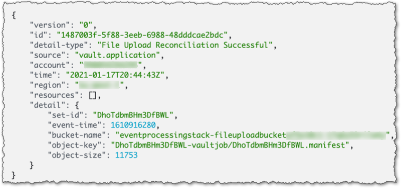

The structure of the "reconcile notification" event, which contains metadata regarding the logical dataset ID and manifest file, is as follows:

```
{
    "version": "0",
    "id": "[ID]",
    "detail-type": "File Upload Reconciliation Successful",
    "source": "vault.application",
    "account": "[ACCOUNT ID]",
    "time": "[YYYY-MM-DDTHH:MM:SSZ]",
    "region": "[REGION]",
    "resources": [],
    "detail": {
        "set-id": "[LOGICAL DATASET ID]",
        "event-time": [EPOCH TIME],
        "bucket-name": "[BUCKET NAME]",
        "object-key": "[MANIFEST FILE OBJECT]",
        "object-size": [SIZE BYTES]
    }
}
```

Since the "reconcile notification" event was sent to the EventBridge custom event bus, this solution can be extended/customised by adding additional targets in the EventBridge rule to allow for other applications/processes to consume the notification and perform further downstream processing on the logical dataset.

The File Gateway implements a write-back cache and asynchronously uploads data to Amazon S3. It optimizes cache usage and the order of file uploads. It may also perform temporary partial uploads during the process of fully uploading a file (the partial copy can be seen momentarily in the Amazon S3 bucket at a smaller size than the original). Hence, you may observe a small delay and/or non-sequential uploads when comparing objects appearing in the Amazon S3 bucket with the arrival of corresponding Amazon CloudWatch Logs.

Since File Upload notifications are **only** generated by the File Gateway when files have been **completely** uploaded to Amazon S3, it is in these scenarios that the File upload notification feature becomes a powerful mechanism to co-ordinate downstream processing. This example data vaulting operation is a good demonstration of real-world scenarios where a File Gateway is often managing hundreds of GBs of uploads to Amazon S3 for hundreds/thousands of files copied by multiple clients.

## Module 7 - Remove CDK application resources
All resources created by this CDK application can be removed by destoying the stacks. Prior to performing this, the Amazon S3 buckets created must be emptied. We'll also logically delete the Storage Gateway (the physical EC2 Storage Gateway instance will be removed when destroying the `DataVaultingStack`). **NOTE:** Only empty the Amazon S3 buckets when you have completed this workshop and no longer require the objects within them. The File Gateway has IAM permissions that **only** allow it to remove objects from the Amazon S3 buckets created by this workshop:

1. Go back to your File Gateway client terminal login. If this has timed out, repeat steps **1-3** in **Module 4.1**.

2. Source the values we retrieved earlier for the Amazon S3 bucket names and File Gateway ARN (when executing the File Gateway activation script in **Module 4.2**). The following command also prints the variable values to the screen, to confirm they have been sourced successfully:
    ```console
    ssm-user@FileGatewayClient>$ source ./vars.sh && \
    echo "" && \
    echo "Storage Gateway ARN: $gatewayArn" && \
    echo "Amazon S3 file upload bucket name: $fileUploadBucketName" && \
    echo "Amazon S3 CDK application scripts bucket name: $cdkApplicationScriptsBucketName" 
    ```

3. Logically delete the Storage Gateway: 
    ```console
    ssm-user@FileGatewayClient>$ aws storagegateway delete-gateway --gateway-arn $gatewayArn
    ```

    Below is a screenshot illustrating an example delete command:

    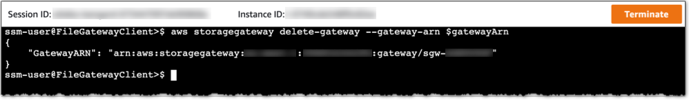

4. Empty the Amazon S3 buckets:
    ```console
    ssm-user@FileGatewayClient>$ aws s3 rm s3://$fileUploadBucketName --recursive
    ssm-user@FileGatewayClient>$ aws s3 rm s3://$cdkApplicationScriptsBucketName --recursive
    ```

    Below is a screenshot illustrating an example delete command on the Amazon S3 CDK application scripts bucket:

    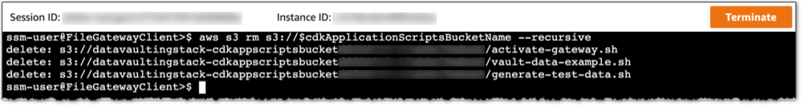

5. You can now destroy the CDK application stacks:
    ```console
    user@cdk-client>$ cdk destroy DataVaultingStack
    user@cdk-client>$ cdk destroy EventProcessingStack
    ```